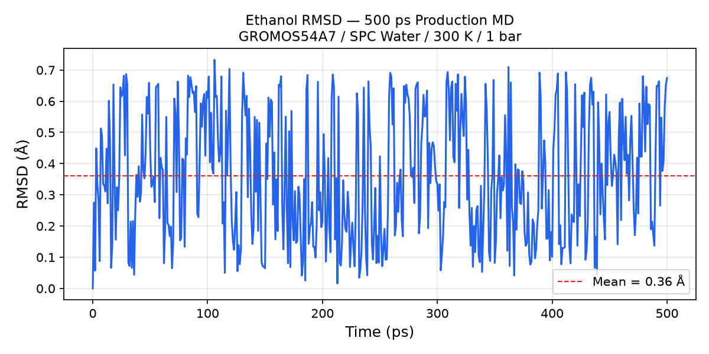
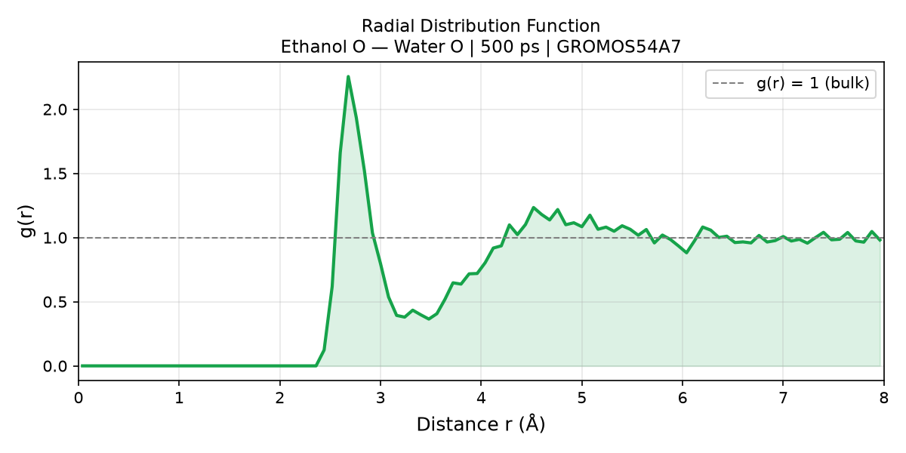

# Project 2 — Molecular Dynamics Simulation of Ethanol in Water
## GROMACS | GROMOS54A7 Force Field | 500 ps Production MD

Part of a computational chemistry portfolio for MSc Chemistry applications 

---

## Scientific Question

How does an ethanol molecule behave dynamically in bulk water at physiological conditions (300 K, 1 bar)? Specifically:
- Is the molecule structurally stable over 500 ps? (RMSD)
- How does water organise around ethanol's hydroxyl group? (Radial Distribution Function)

Ethanol was chosen as the model system because its hydroxyl group (−OH) is chemically identical to the functional groups responsible for antioxidant activity in the polyphenols studied in Project 1 (quercetin, catechin, caffeic acid, ascorbic acid, rutin). This simulation provides the dynamic, structural picture of exactly the hydrogen-bonding interaction that makes those molecules biologically active.

---

## Connection to Project 1

Project 1 answered a **static question** — what does quercetin's electronic structure look like at 0 K using DFT?  
Project 2 answers a **dynamic question** — how does a molecule with OH groups actually behave in water over time at room temperature?

| | Project 1 | Project 2 |
|---|---|---|
| Method | DFT (quantum mechanics) | MD (classical mechanics) |
| Software | ORCA 6.1.1 | GROMACS 2023.3 |
| Question | Electronic structure | Dynamic behaviour in solvent |
| Output | ESP maps, HOMO-LUMO gaps | RMSD plot, RDF plot |
| Temperature | 0 K (static) | 300 K (room temperature) |

---

## System Details

| Parameter | Value |
|---|---|
| Solute | Ethanol (CH₃CH₂OH) |
| Representation | United-atom (CH₂ and CH₃ as pseudoatoms) |
| Force field | GROMOS54A7 |
| Water model | SPC |
| Box geometry | Cubic |
| Box size | 2.334 nm |
| Water molecules | 416 |
| Total atoms | 1252 |
| Temperature | 300 K (V-rescale thermostat) |
| Pressure | 1 bar (Berendsen barostat) |
| Timestep | 1 fs |
| Production length | 500 ps |
| Platform | WSL2 Ubuntu 24.04, Intel CPU, 16 threads |

---

## Workflow

### Step 1 — Structure Preparation
Ethanol was written as a PDB file using GROMOS54A7 united-atom atom names (ETHH residue). In the united-atom representation, CH₂ and CH₃ groups are treated as single pseudoatoms — only the hydroxyl hydrogen (EH) is explicit. This is standard practice for GROMOS force fields.

### Step 2 — Topology Generation
```bash
gmx pdb2gmx -f Structures/ethanol.pdb -o Structures/ethanol_gmx.gro \
  -p topol.top -ff gromos54a7 -water spc
```
Result: Total mass 46.069 Da, total charge 0.000 e — confirmed correct.

### Step 3 — Solvation
```bash
gmx editconf -f Structures/ethanol_gmx.gro -o Structures/ethanol_box.gro \
  -c -d 1.0 -bt cubic
gmx solvate -cp Structures/ethanol_box.gro -cs spc216.gro \
  -o Structures/ethanol_solv.gro -p topol.top
```
416 SPC water molecules added. Starting density: 985 kg/m³.

### Step 4 — Energy Minimisation
Algorithm: Steepest descent  
Convergence criterion: Fmax < 1000 kJ/mol/nm  
Result: Converged in 77 steps, Epot = −17,898 kJ/mol

### Step 5 — NVT Equilibration (100 ps)
Constant volume, 300 K, V-rescale thermostat, position restraints on ethanol.  
Result: Temperature stable at 300.6 K 

### Step 6 — NPT Equilibration (100 ps)
Constant pressure, 1 bar, Berendsen barostat, no position restraints on ethanol.  
Result: Density stable at 975.6 kg/m³ 

### Step 7 — Production MD (500 ps)
Unrestrained dynamics, 500,000 steps at 1 fs timestep.  
Output: md.xtc trajectory (500 frames, one every 1 ps)

### Step 8 — Analysis
PBC correction applied using gmx trjconv. RMSD and RDF computed using MDAnalysis 2.10.0 in Python.

---

## Troubleshooting Notes

### Issue 1 — NPT Segmentation Fault with Parrinello-Rahman Barostat
**Error:** Simulation crashed at step ~16800 with segmentation fault and NaN box vectors.  
**Cause:** GROMACS itself warned that combining Parrinello-Rahman pressure coupling with absolute position restraints on a small molecule causes instabilities in the box vectors.  
**Fix:** Switched to Berendsen barostat for the NPT equilibration phase, which is more stable for small molecule solvation systems. Removed position restraints from NPT entirely since ethanol is too small to require them.

### Issue 2 — Production MD Segmentation Fault at Step ~21900
**Error:** Production MD crashed consistently at the same step with segmentation fault.  
**Cause:** GROMACS had warned earlier that the O−H bond in ethanol has an oscillational period of ~0.011 ps, which is less than 10× the 2 fs timestep. This caused the bond to become numerically unstable during dynamics.  
**Fix:** Reduced timestep from 2 fs to 1 fs and doubled the number of steps from 250,000 to 500,000 to maintain 500 ps total simulation time. Simulation ran to completion without further issues.

**Note:** Both issues were flagged by GROMACS warnings during the grompp preprocessing step. This demonstrates the importance of reading all warnings before running — they predicted both failures accurately.

---

## Results

### RMSD — Ethanol Structural Stability


Ethanol RMSD fluctuates between 0 and 0.7 Å around a stable mean of **0.36 Å** throughout the entire 500 ps trajectory. There is no upward drift, confirming the molecule does not unfold, escape, or collapse. The rapid fluctuations are physically correct — ethanol is a 4-atom united-atom molecule freely tumbling in water at 300 K, so large rotational and translational motion relative to the reference frame is expected.

### RDF — Water Organisation Around Ethanol's Hydroxyl Group


The radial distribution function g(r) between ethanol oxygen (EO) and water oxygen (OW) shows:

- **g(r) = 0 for r < 2.3 Å** — excluded volume region; no water can penetrate closer than van der Waals contact distance
- **Sharp peak at r ≈ 2.7 Å, g(r) ≈ 2.25** — first solvation shell; water molecules hydrogen-bonded directly to ethanol's OH group. The peak height of 2.25 indicates water is 2.25× more likely to be found at this distance than in bulk, quantifying the strength of the hydrogen bond
- **g(r) → 1 at r > 6 Å** — bulk water behaviour recovered; beyond the second solvation shell the system is indistinguishable from pure water

The 2.7 Å O−O hydrogen bond distance is in excellent agreement with experimental and computational literature values for O−H···O hydrogen bonds (2.7–2.9 Å).

---

## Scientific Interpretation

The RDF peak at 2.7 Å is the molecular dynamics signature of the same hydrogen-bonding interaction that underpins the antioxidant activity quantified in Project 1. The five hydroxyl groups on quercetin — which produce the smallest HOMO-LUMO gap and the most electron-rich ESP surface — interact with biological targets and free radicals through exactly this type of O−H···O interaction. Project 2 demonstrates what that interaction looks like structurally and dynamically in an aqueous environment at room temperature.

---

## Files

```
MD_Project/
├── Structures/
│   ├── ethanol.pdb           — input structure (GROMOS54A7 atom names)
│   ├── ethanol_gmx.gro       — GROMACS coordinate file
│   ├── ethanol_box.gro       — after box definition
│   └── ethanol_solv.gro      — after solvation (1 ethanol + 416 water)
├── MDP/
│   ├── em.mdp                — energy minimisation parameters
│   ├── nvt.mdp               — NVT equilibration (100 ps)
│   ├── npt.mdp               — NPT equilibration (100 ps)
│   └── md.mdp                — production MD (500 ps, 1 fs timestep)
├── Analysis/
│   ├── analysis.py           — MDAnalysis Python script
│   ├── rmsd.png              — RMSD plot
│   └── rdf.png               — RDF plot
├── topol.top                 — full system topology
├── posre.itp                 — position restraints (used in NVT only)
└── index.ndx                 — GROMACS index file
```

---

## Software

| Software | Version | Purpose |
|---|---|---|
| GROMACS | 2023.3 | MD engine |
| MDAnalysis | 2.10.0 | Trajectory analysis |
| matplotlib | 3.11.1 | Plotting |
| numpy | 2.5.1 | Numerical analysis |
| Python | 3.12 | Analysis scripting |
| WSL2 Ubuntu | 24.04 | Operating environment |

---